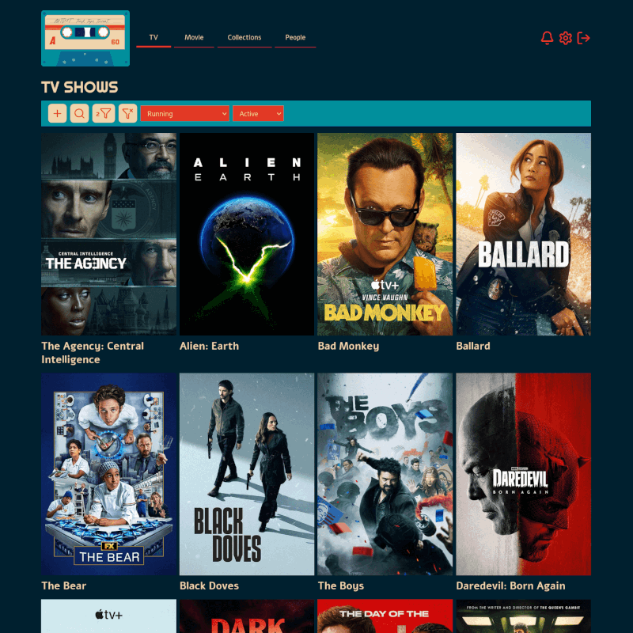
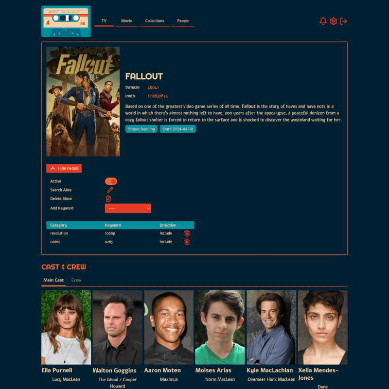
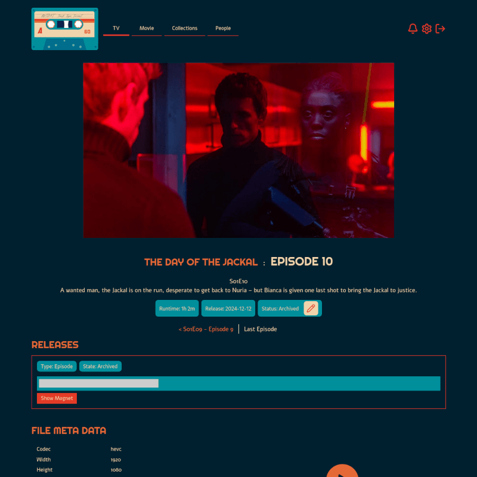
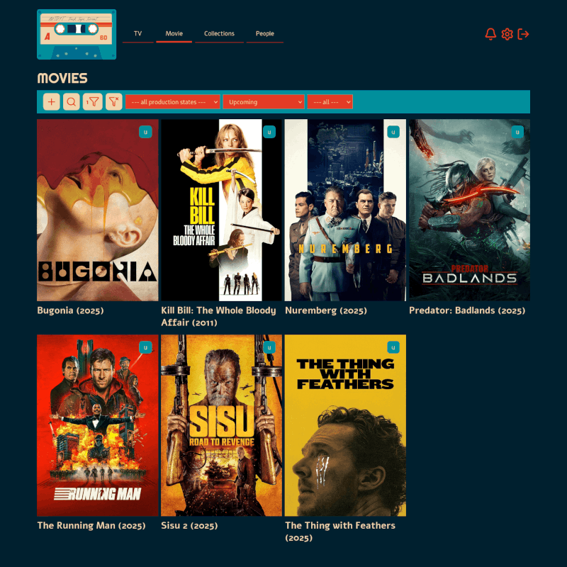
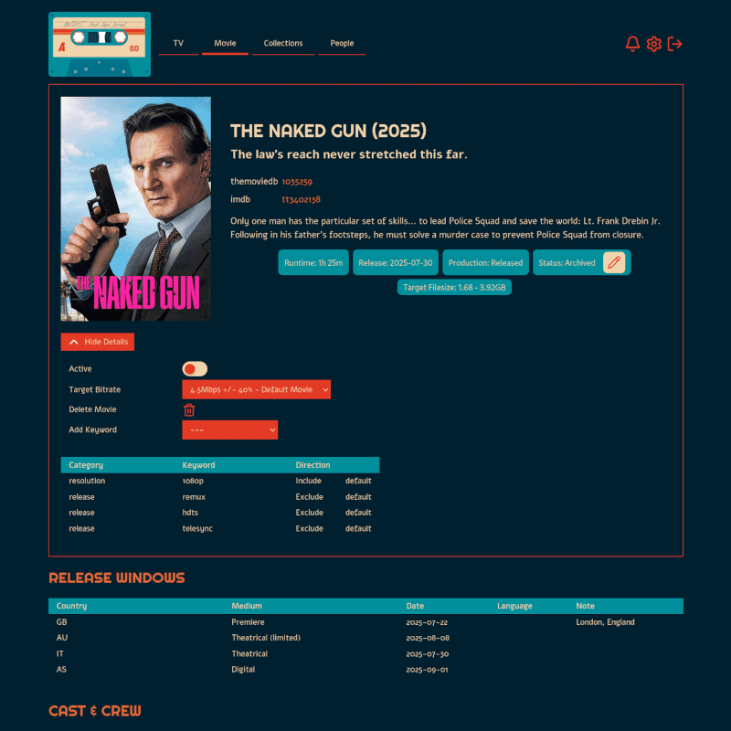
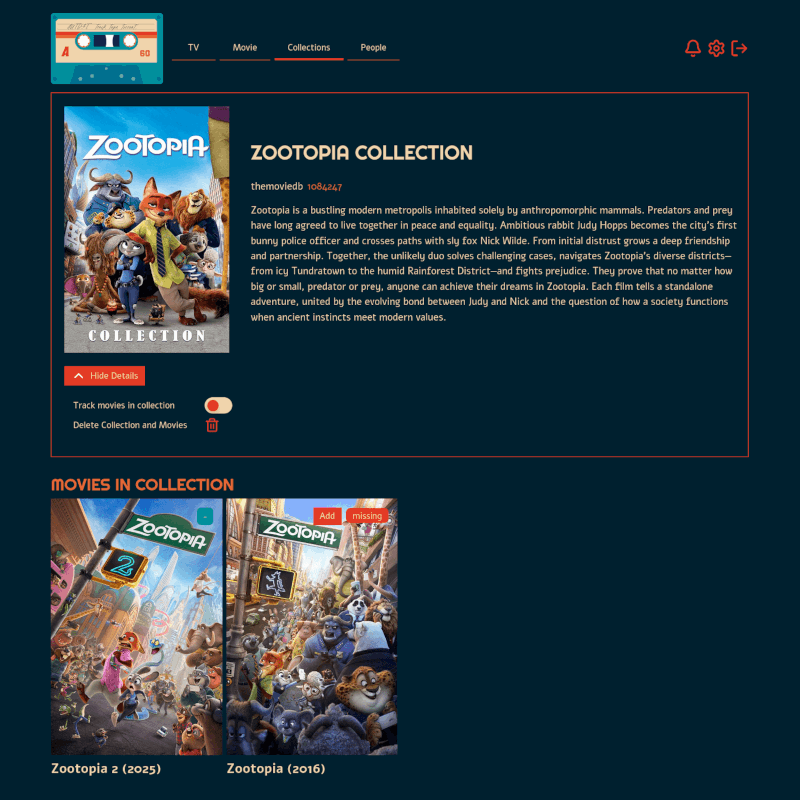
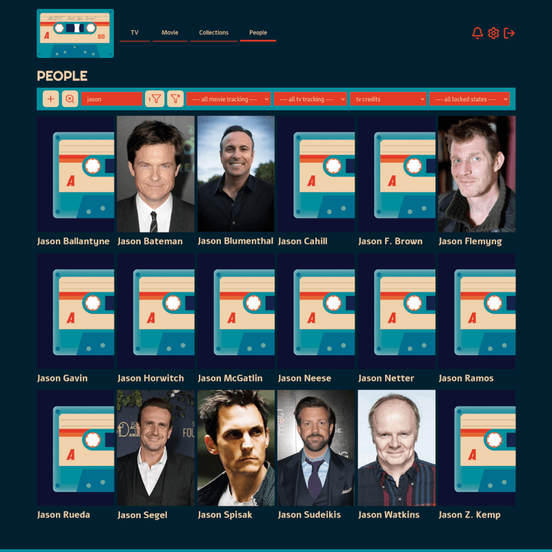
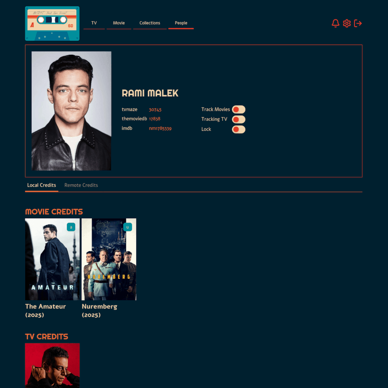
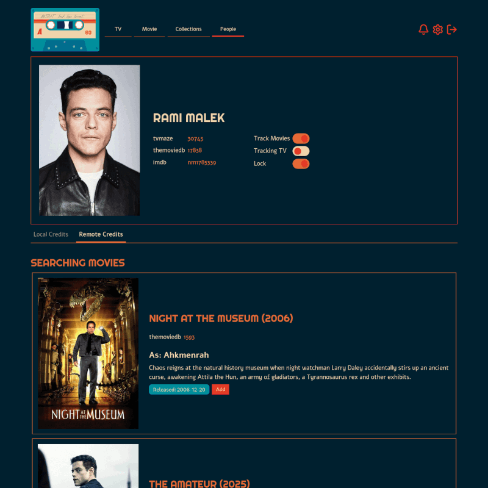

# Screenshots

A selection of full page screenshots of the application. Click on the thumbnail to open the full uncropped version.

## TV Shows

* <a href="assets/screenshot-show-list-page.png">TV Show list, cropped</a>
* <a href="assets/screenshot-show-detail-page.png">TV Show detail page</a>
* <a href="assets/screenshot-episode-detail-page.png">TV Show Episode detail page</a>

## Movies

* <a href="assets/screenshot-movie-list-page.png">Movie list page</a>
* <a href="assets/screenshot-movie-detail-page.png">Movie detail page</a>

## Collections

* <a href="assets/screenshot-collection-detail-page.png">Collection detail page</a>

## People

* <a href="assets/screenshot-people-list-page.png">People list page</a>
* <a href="assets/screenshot-people-detail-local-page.png">Person detail page local credits</a>
* <a href="assets/screenshot-people-detail-remote-page.png">Person detail page remote credits, cropped</a>

