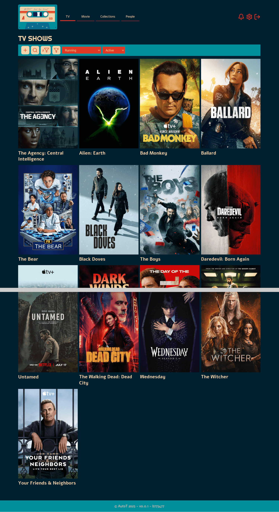
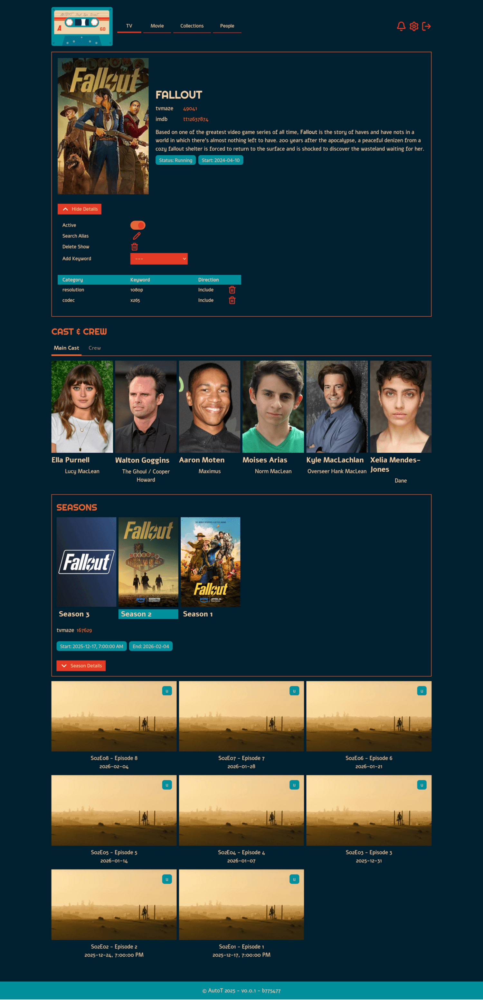
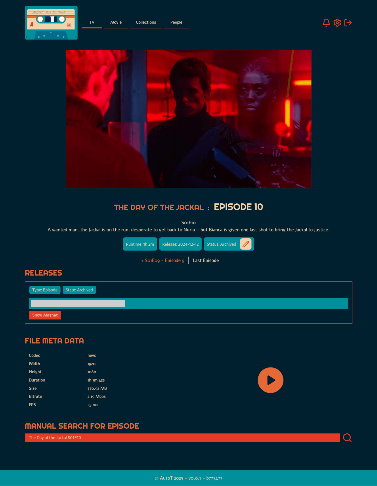
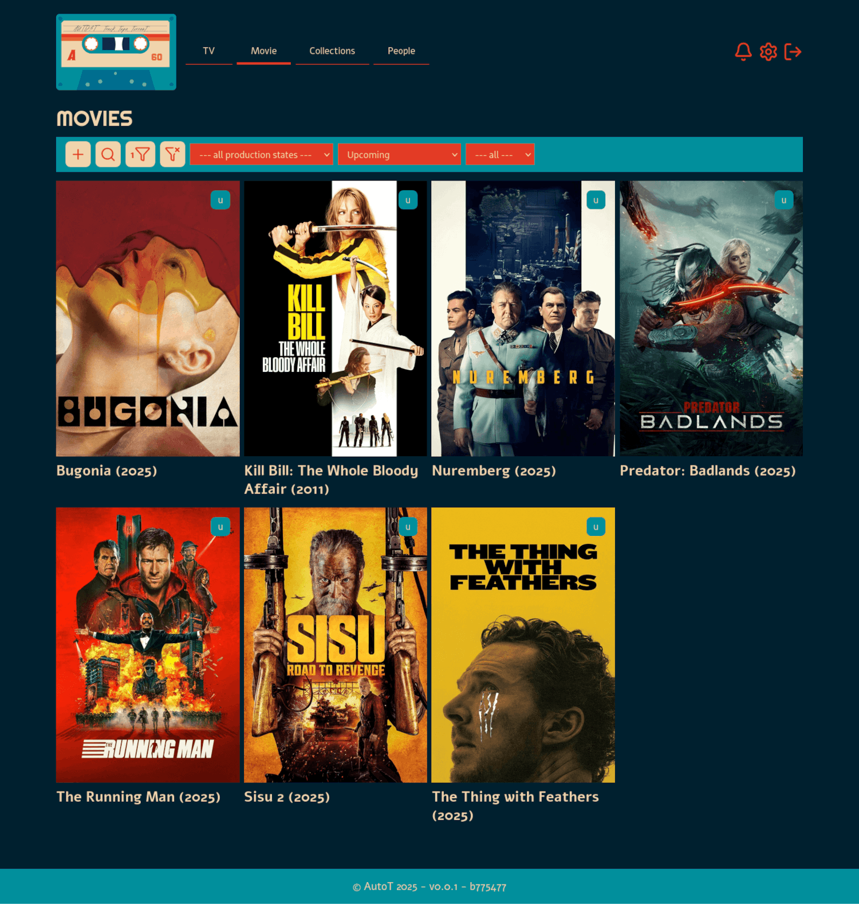
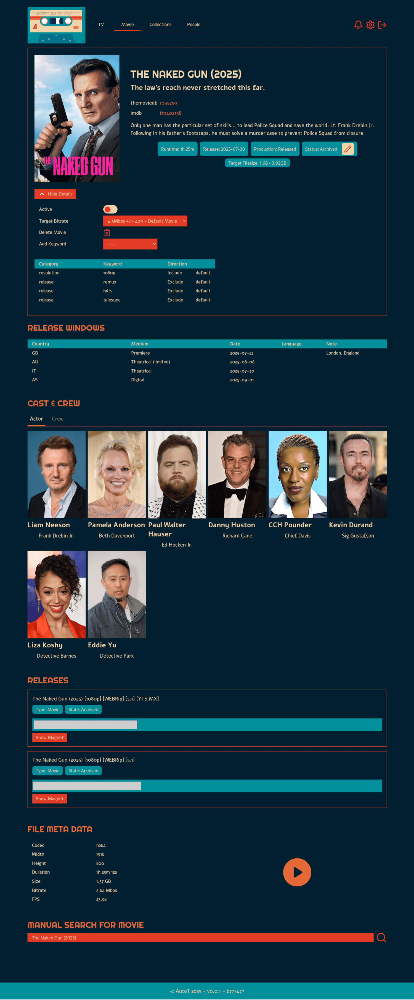
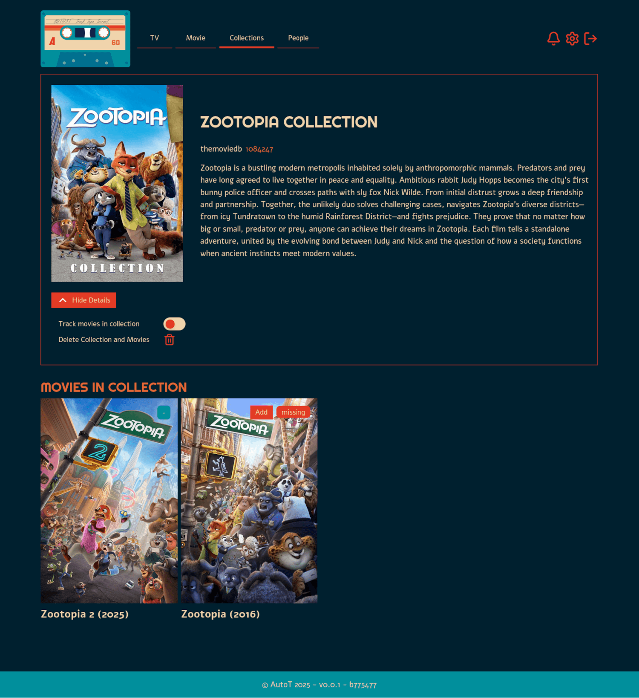
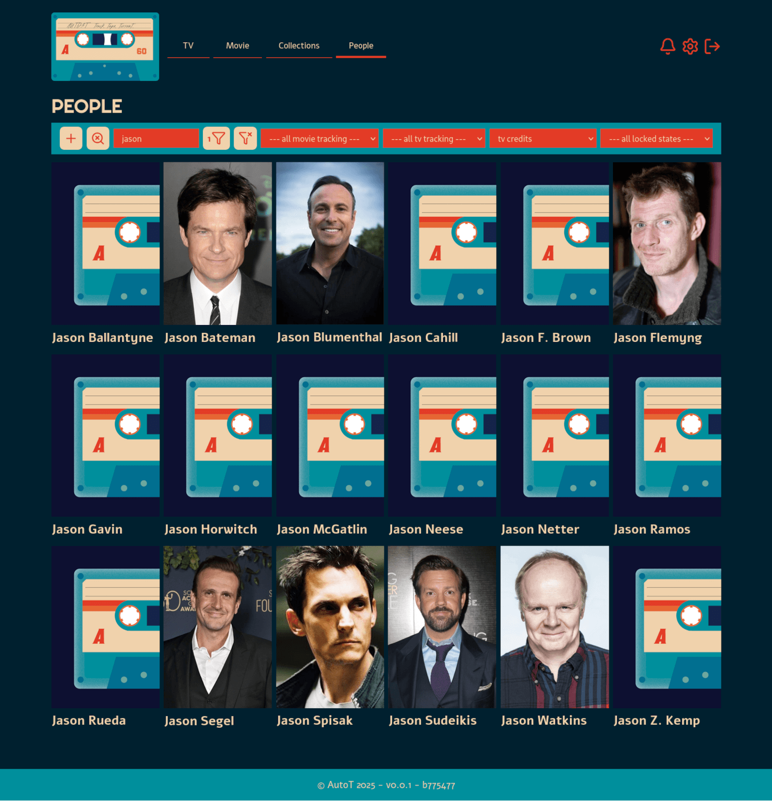
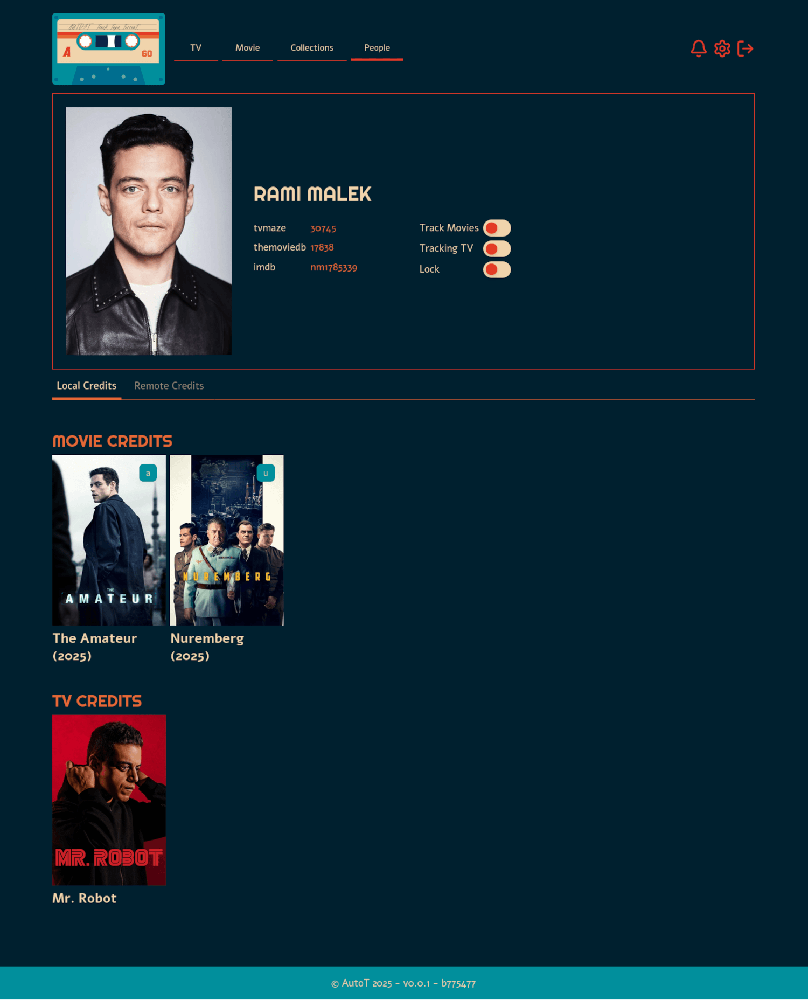
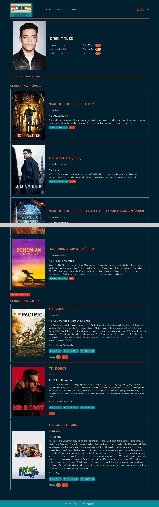

# Screenshots

A selection of full page screenshots of the application.

## TV Shows

* TV Show list, cropped
* TV Show detail page
* TV Show Episode detail page

    
    
    

## Movies

* Movie list page
* Movie detail page

    
    

## Collections

* Collection detail page

    

## People

* People list page
* Person detail page local credits
* Person detail page remote credits, cropped

    
    
    

